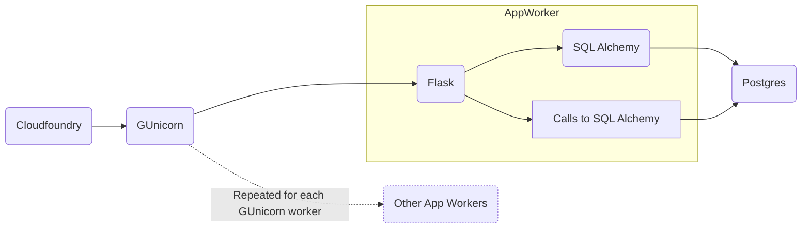

# RAS Party optimisations - caching

- [RAS Party optimisations - caching](#ras-party-optimisations---caching)
  - [Introduction](#introduction)
  - [Approach](#approach)
  - [Generation of metrics](#generation-of-metrics)
  - [Result sets](#result-sets)
    - [Baseline](#baseline)
      - [Against Docker Image](#against-docker-image)
        - [Request Count: 100](#request-count-100)
        - [Request Count: 200](#request-count-200)
        - [Request Count: 500](#request-count-500)
        - [Overall](#overall)
        - [Per-route](#per-route)
          - [Commentary](#commentary)
      - [Against GUnicorn run](#against-gunicorn-run)
        - [Request Count: 100](#request-count-100-1)
        - [Request Count: 200](#request-count-200-1)
        - [Request Count: 500](#request-count-500-1)
        - [Overall](#overall-1)
        - [Per-route](#per-route-1)
          - [Commentary](#commentary-1)
    - [Results with `SimpleCache` basic caching](#results-with-simplecache-basic-caching)
      - [Request Count: 100](#request-count-100-2)
      - [Request Count: 200](#request-count-200-2)
      - [Request Count: 500](#request-count-500-2)
      - [Overall](#overall-2)
      - [Per-route](#per-route-2)
        - [Commentary](#commentary-2)
  - [Root-cause analysis](#root-cause-analysis)
    - [Isolating the issues](#isolating-the-issues)
      - [Comparing route hits, queries started and queries completed](#comparing-route-hits-queries-started-and-queries-completed)
      - [Testing changes to the error handling in Flask](#testing-changes-to-the-error-handling-in-flask)
      - [Testing improved settings in SQLAlchemy](#testing-improved-settings-in-sqlalchemy)
        - [Single route with 500 connections](#single-route-with-500-connections)
        - [Comments](#comments)
      - [Single route with 100 connections](#single-route-with-100-connections)
      - [Testing changes to GUnicorn settings.](#testing-changes-to-gunicorn-settings)

## Introduction
For ASHE, and also for general benefit, the `ras-party` service needs to be optimised for best performance.  This spike investigates how performance could be improved, what bottlenecks could be found, and what ongoing tasks may be necessary.

As my part of this spike, I investigated the possibilities of using route caching within the system, and how different methods may work for that

## Approach
* Generate metrics of existing system
* Attempt caching of routes
* Generate new metrics
* Alter settings and tweak as time allows

## Generation of metrics
Initially, I observed the response times using postman, to see how they seemed, but soon, wrote a script to hit URLs with variable speed, volume, and parameters, in order to avoid the performance seeming better by gathering anecdotal info, rather than data.

I did hit some issues with my utility in that running it proved unachieveable beyond ~2000 requests per URL, however, I _did_ find some interesting issues with that volume, and so produced info for metrics using the following parameters:

* Database loaded with 10000 businesses
* Hit urls:
    * `/businesses?id=[BUSINESS_ID]`
    * `/businesses/ref/[BUSINESS_REF]`
    *  `/businesses/id/[BUSINESS_ID]`
 *  Hit each with request loads of 100, 200, and 500 requests in a set, separated by delays of 50ms, 100ms, 200ms, 1000ms, and 2000ms.
* This resulted in 45 different tests being performed against the system, being 5 possibilities for repeat amount, 5 possibilities for request offset, and 3 for URL.  A total of 12000 requests were fired against party.
* Parameters for each request were loaded from JSON files, and were selected at random from these files.

Metrics used to create a baseline, and then repeated after the attempts at optimisation.

_NB: I wanted to test against more routes, and specifically against `PUT`, `POST`, `PATCH` and `UPDATE` routes too - to allow us to see how different operations affected performance.  Time proved too short to allow this, and I reached a point at which I was essentially writing a performance testing framework in rough code, which should be a task for later_

## Result sets
### Baseline
The baseline produced interesting results to begin with.  Broadly speaking, the party service doesn't cope well with any amount of requests above 5/second.

#### Against Docker Image
Total Sample Size: 12000

##### Request Count: 100
| Offset | Success (`200`) | No Response | `404` | `500` |
|--------|-----------------|-------------|-------|-------|
| 50 | 39.33 | 60.33 | 0.00 | 0.33 |
| 100 | 35.83 | 63.83 | 0.00 | 0.33 |
| 200 | 39.33 | 60.00 | 0.00 | 0.67 |
| 1000 | 48.33 | 51.00 | 0.00 | 0.67 |
| 2000 | 65.00 | 34.00 | 0.00 | 1.00 |

##### Request Count: 200
| Offset | Success (`200`) | No Response | `404` | `500` |
|--------|-----------------|-------------|-------|-------|
| 50 | 25.67 | 74.00 | 0.00 | 0.33 |
| 100 | 39.17 | 60.83 | 0.00 | 0.00 |
| 200 | 50.25 | 49.75 | 0.00 | 0.00 |
| 1000 | 63.17 | 36.83 | 0.00 | 0.00 |
| 2000 | 79.17 | 20.83 | 0.00 | 0.00 |

##### Request Count: 500
| Offset | Success (`200`) | No Response | `404` | `500` |
|--------|-----------------|-------------|-------|-------|
| 50 | 14.67 | 85.33 | 0.00 | 0.00 |
| 100 | 51.83 | 48.10 | 0.00 | 0.07 |
| 200 | 64.57 | 34.83 | 0.00 | 0.60 |
| 1000 | 83.60 | 16.40 | 0.00 | 0.00 |
| 2000 | 91.33 | 8.60 | 0.00 | 0.07 |

##### Overall
| Offset | Success (`200`) | No Response | `404` | `500` |
|--------|-----------------|-------------|-------|-------|
| 50 | 20.50 | 79.38 | 0.00 | 0.13 |
| 100 | 46.67 | 53.25 | 0.00 | 0.08 |
| 200 | 57.83 | 41.71 | 0.00 | 0.46 |
| 1000 | 74.08 | 25.83 | 0.00 | 0.08 |
| 2000 | 85.00 | 14.83 | 0.00 | 0.17 |

##### Per-route
| Route | Success (`200`) | No Response | `404` | `500` |
|--------|-----------------|-------------|-------|-------|
| /businesses?id= | 45.57 | 54.20 | 0.00 | 0.22 |
| /businesses/id/ | 47.73 | 52.02 | 0.00 | 0.25 |
| /businesses/ref/ | 44.40 | 55.35 | 0.00 | 0.25 |
| _All Routes Combined_ | 45.90 | 53.86 | 0.00 | 0.24 |

###### Commentary
Overall and in isolation, these results are all very disappointing.  Even at a very low request rate, our success rate is poor - however it's important to remember that this is not a facsimile testing environment, so it's hard to say how well it represents that base environment, but it should provide a good idea of how changes have affected performance.

Most concerning is that the majority of failures are occurring when without response - the server should be returning an HTTP status code, and logging errors, and it's instead dropping the connection - suggesting a pretty profound failure, or bad error handling.

#### Against GUnicorn run
##### Request Count: 100
| Offset | Success (`200`) | No Response | `404` | `500` |
|--------|-----------------|-------------|-------|-------|
| 50 | 28.67 | 71.33 | 0.00 | 0.00 |
| 100 | 46.00 | 54.00 | 0.00 | 0.00 |
| 200 | 50.17 | 49.83 | 0.00 | 0.00 |
| 1000 | 67.67 | 32.33 | 0.00 | 0.00 |
| 2000 | 82.33 | 17.67 | 0.00 | 0.00 |

##### Request Count: 200
| Offset | Success (`200`) | No Response | `404` | `500` |
|--------|-----------------|-------------|-------|-------|
| 50 | 26.33 | 73.67 | 0.00 | 0.00 |
| 100 | 53.50 | 46.50 | 0.00 | 0.00 |
| 200 | 60.92 | 39.08 | 0.00 | 0.00 |
| 1000 | 84.17 | 15.83 | 0.00 | 0.00 |
| 2000 | 92.17 | 7.83 | 0.00 | 0.00 |

##### Request Count: 500
| Offset | Success (`200`) | No Response | `404` | `500` |
|--------|-----------------|-------------|-------|-------|
| 50 | 21.20 | 78.80 | 0.00 | 0.00 |
| 100 | 63.77 | 36.23 | 0.00 | 0.00 |
| 200 | 81.43 | 18.57 | 0.00 | 0.00 |
| 1000 | 92.80 | 7.20 | 0.00 | 0.00 |
| 2000 | 96.20 | 3.80 | 0.00 | 0.00 |

##### Overall
| Offset | Success (`200`) | No Response | `404` | `500` |
|--------|-----------------|-------------|-------|-------|
| 50 | 23.42 | 76.58 | 0.00 | 0.00 |
| 100 | 58.98 | 41.02 | 0.00 | 0.00 |
| 200 | 72.40 | 27.60 | 0.00 | 0.00 |
| 1000 | 87.50 | 12.50 | 0.00 | 0.00 |
| 2000 | 93.46 | 6.54 | 0.00 | 0.00 |

##### Per-route
| Route | Success (`200`) | No Response | `404` | `500` |
|--------|-----------------|-------------|-------|-------|
| /businesses?id= | 57.03 | 42.98 | 0.00 | 0.00 |
| /businesses/id/ | 57.83 | 42.18 | 0.00 | 0.00 |
| /businesses/ref/ | 56.85 | 43.15 | 0.00 | 0.00 |
| _All Routes Combined_ | 57.23 | 42.77 | 0.00 | 0.00 |

###### Commentary
Running with `GUnicorn` improves matters - assumedly by forwarding fewer responses until the server is ready, but we still have a worryingly high number of failed responses.

Running with `GUnicorn` locally _entirely_ eliminates the HTTP responses, which is a very strange result, the cause of which needs investigation.


### Results with `SimpleCache` basic caching

Total Sample Size: 12000

#### Request Count: 100
| Offset | Success (`200`) | No Response | `404` | `500` |
|--------|-----------------|-------------|-------|-------|
| 50 | 93.33 | 6.67 | 0.00 | 0.00 |
| 100 | 93.33 | 6.67 | 0.00 | 0.00 |
| 200 | 95.83 | 4.17 | 0.00 | 0.00 |
| 1000 | 97.67 | 2.33 | 0.00 | 0.00 |
| 2000 | 99.00 | 1.00 | 0.00 | 0.00 |

#### Request Count: 200
| Offset | Success (`200`) | No Response | `404` | `500` |
|--------|-----------------|-------------|-------|-------|
| 50 | 91.67 | 8.33 | 0.00 | 0.00 |
| 100 | 96.83 | 3.17 | 0.00 | 0.00 |
| 200 | 97.33 | 2.67 | 0.00 | 0.00 |
| 1000 | 98.67 | 1.33 | 0.00 | 0.00 |
| 2000 | 99.50 | 0.50 | 0.00 | 0.00 |

#### Request Count: 500
| Offset | Success (`200`) | No Response | `404` | `500` |
|--------|-----------------|-------------|-------|-------|
| 50 | 92.60 | 7.40 | 0.00 | 0.00 |
| 100 | 97.67 | 2.33 | 0.00 | 0.00 |
| 200 | 98.83 | 1.17 | 0.00 | 0.00 |
| 1000 | 99.80 | 0.20 | 0.00 | 0.00 |
| 2000 | 99.67 | 0.33 | 0.00 | 0.00 |

#### Overall
| Offset | Success (`200`) | No Response | `404` | `500` |
|--------|-----------------|-------------|-------|-------|
| 50 | 92.46 | 7.54 | 0.00 | 0.00 |
| 100 | 96.92 | 3.08 | 0.00 | 0.00 |
| 200 | 98.08 | 1.92 | 0.00 | 0.00 |
| 1000 | 99.25 | 0.75 | 0.00 | 0.00 |
| 2000 | 99.54 | 0.46 | 0.00 | 0.00 |

#### Per-route
| Route | Success (`200`) | No Response | `404` | `500` |
|--------|-----------------|-------------|-------|-------|
| /businesses?id= | 96.35 | 3.65 | 0.00 | 0.00 |
| /businesses/id/ | 96.40 | 3.60 | 0.00 | 0.00 |
| /businesses/ref/ | 96.73 | 3.28 | 0.00 | 0.00 |
| _All Routes Combined_ | 96.49 | 3.51 | 0.00 | 0.00 |

##### Commentary
These results show significant improvement, but it's important to note:

* Any result of less the ~99% success shouldn't be considered good - this is still most of the results made at faster that 1/second.
* This approach reduces load on the database but _doesn't_ address why the load on the database was problematic in the first instance. ** This is an important piece to address **
* This may be useful, but it's not a magic bullet fix - it's kicking the problem down the road, with no idea of when it may fail further.  We need to understand why performance was so unusually low in the first instance.

## Root-cause analysis
The root cause of the slowness of party is what we have to determine in order to correctly address the problem/problems.  Whilst we could patch over some of these issues with caching, and possibly other solutions, it leaves us in a place where we still don't know at what point the problems may re-occur.

Loading testing can tell us where the problem will reoccur, but this can't be done until the performance environment is available again - it may also require very high load, which could be costly.

The flow of a request through the system is:



We can eliminate some of these because we have not included them in current tests, but have still seen issues.  This _doesn't_ mean they aren't the cause of issues, but that they aren't the cause of the issues we've seen thus far in these tests.

_Cloudfoundary_ is not the cause of the issues so far, because we haven't yet run performance tests on this - it's also relatively unlikely, as CF is a third party service that is managed and maintained commercially - we don't do as much config of it.

_GUnicorn_ is a real potential point of weakness - it has lots of different configuration methods, and because it aims to be a "Just Works" style solution, it is mostly quite opaque about how it works, and what the pain points with config may be.  Tests should be run focussed on GUnicorn.

_Flask_ itself is unlikely to be an issue, but it's _likely_ that some performance optimisations could be made by using the caching described (or one of the many other similar approaches).  It's also relatively likely that our code contains areas that we should improve or optimise.  It's harder for us to optimise the setting of data, rather than the retrieval of it, so we should consider which routes are known to have the biggest burdens, and address these in order.

_Database Queries_ may have points at which they are making inefficient use of the capabiltiies of the database connector (SQLAlchemy).  We are likely to be making multiple calls to the database in cases in which single, more complex calls could be made, this could also reduce load on the database

_Postgres_ may have configuration issues, resourcing issues, or other issues that affect its ability to cater for the requests.

### Isolating the issues
#### Comparing route hits, queries started and queries completed
I added logging lines to record when a particular get function was git, when it reached its query, and when it completed its query, and found the following results:

`/businesses/id/[ID]`

|       | Requests sent | Function hit | Query started | Query completed |
|-------|---------------|--------------|---------------|-----------------|
| Count |4000           |4000          |4000           |3484             |

So, all 4000 requests, sent at various speeds, from 20/second to 0.5/second hit the function, and try the query.  This is useful to know, because while it doesn't mean our code is perfect, or that it can cause no issues at all, it does mean that within the bounds of our testing, which has been relatively intensive, flask has coped with all of it.  We can know summise that the issues we are principally seeing are in the making of a query, so in SQL Alchemy or Postgres.

The hammer utility at this stage reports that 87% of its requests were successful, which is consistent with the above.

To further cut down issues, I ran the full test suite (12000 requests on 3 URLs), and the results looked like this:

|       | Requests sent | Function hit | Query started | Query completed |
|-------|---------------|--------------|---------------|-----------------|
| Count |12000          |9306          |9306           |6273             |


| Success (`200`) | No Response | `404` | `500` |
|-----------------|-------------|-------|-------|
| 39.60           | 22.45       | 0.00  | 37.95 |

Showing that a sustained load results in a fairly concerning amount of failures.  The fact that ~2700 requests never reached their route function is indicative that either the other routes are less reliable, _or_ at a higher load, Flask itself ceases to cope.  So we know now that we have some issue in Flask itself, and to a greater degree, somewhere in the data access.  Closer review of the data from the hammer utility shows that all routes performed approximately equally in this sustained test, so no single route is more of a problem.

_NB: There is the possibility inherent in this that the errors now occurring in Flask are actually caused by the **same** issue we initially saw.  If SQL Alchemy or Postgres is causing Flask to wait, then this could cause Flask to be less responsive, and have processes tied up waiting for the data layer to recover.  Although these present as issues in Flask, they could be either minor issues with error handling in our Flask app, or they could be unavoidable within Flask_

During the sustained test, Flask threw the below error:

```stacktrace
----------------------------------------
Exception happened during processing of request from ('127.0.0.1', 50330)
Traceback (most recent call last):
  File "/Users/owen/.pyenv/versions/3.6.6/lib/python3.6/socketserver.py", line 317, in _handle_request_noblock
    self.process_request(request, client_address)
  File "/Users/owen/.pyenv/versions/3.6.6/lib/python3.6/socketserver.py", line 666, in process_request
    t.start()
  File "/Users/owen/.pyenv/versions/3.6.6/lib/python3.6/threading.py", line 846, in start
    _start_new_thread(self._bootstrap, ())
RuntimeError: can't start new thread
----------------------------------------
```
Which is indicative of Flask attempting to open a new process, but having no threading available - a situation I would think could cause a complete lack of response in Flask.

Flask logs included the below error:
```json
{
    "status": 500,
    "event": "Uncaught exception",
    "level": "exception",
    "service": "ras-party",
    "exception": "Traceback (most recent call last):\n  File \"/Users/owen/Development/ONS/ras-party/ras_party/support/session_decorator.py\", line 19, in handle_session\n    result = f(*args, session=session, **kwargs)\n  File \"/Users/owen/Development/ONS/ras-party/ras_party/controllers/business_controller.py\", line 55, in get_businesses_by_ids\n    return [business.to_business_summary_dict() for business in businesses]\n  File \"/Users/owen/.local/share/virtualenvs/ras-party-7Zu4MBMY/lib/python3.6/site-packages/sqlalchemy/orm/query.py\", line 2995, in __iter__\n    return self._execute_and_instances(context)\n  File \"/Users/owen/.local/share/virtualenvs/ras-party-7Zu4MBMY/lib/python3.6/site-packages/sqlalchemy/orm/query.py\", line 3016, in _execute_and_instances\n    close_with_result=True)\n  File \"/Users/owen/.local/share/virtualenvs/ras-party-7Zu4MBMY/lib/python3.6/site-packages/sqlalchemy/orm/query.py\", line 3025, in _get_bind_args\n    **kw\n  File \"/Users/owen/.local/share/virtualenvs/ras-party-7Zu4MBMY/lib/python3.6/site-packages/sqlalchemy/orm/query.py\", line 3007, in _connection_from_session\n    conn = self.session.connection(**kw)\n  File \"/Users/owen/.local/share/virtualenvs/ras-party-7Zu4MBMY/lib/python3.6/site-packages/sqlalchemy/orm/session.py\", line 1035, in connection\n    execution_options=execution_options)\n  File \"/Users/owen/.local/share/virtualenvs/ras-party-7Zu4MBMY/lib/python3.6/site-packages/sqlalchemy/orm/session.py\", line 1040, in _connection_for_bind\n    engine, execution_options)\n  File \"/Users/owen/.local/share/virtualenvs/ras-party-7Zu4MBMY/lib/python3.6/site-packages/sqlalchemy/orm/session.py\", line 409, in _connection_for_bind\n    conn = bind.contextual_connect()\n  File \"/Users/owen/.local/share/virtualenvs/ras-party-7Zu4MBMY/lib/python3.6/site-packages/sqlalchemy/engine/base.py\", line 2123, in contextual_connect\n    self._wrap_pool_connect(self.pool.connect, None),\n  File \"/Users/owen/.local/share/virtualenvs/ras-party-7Zu4MBMY/lib/python3.6/site-packages/sqlalchemy/engine/base.py\", line 2158, in _wrap_pool_connect\n    return fn()\n  File \"/Users/owen/.local/share/virtualenvs/ras-party-7Zu4MBMY/lib/python3.6/site-packages/sqlalchemy/pool.py\", line 400, in connect\n    return _ConnectionFairy._checkout(self)\n  File \"/Users/owen/.local/share/virtualenvs/ras-party-7Zu4MBMY/lib/python3.6/site-packages/sqlalchemy/pool.py\", line 788, in _checkout\n    fairy = _ConnectionRecord.checkout(pool)\n  File \"/Users/owen/.local/share/virtualenvs/ras-party-7Zu4MBMY/lib/python3.6/site-packages/sqlalchemy/pool.py\", line 529, in checkout\n    rec = pool._do_get()\n  File \"/Users/owen/.local/share/virtualenvs/ras-party-7Zu4MBMY/lib/python3.6/site-packages/sqlalchemy/pool.py\", line 1186, in _do_get\n    (self.size(), self.overflow(), self._timeout), code=\"3o7r\")\nsqlalchemy.exc.TimeoutError: QueuePool limit of size 5 overflow 10 reached, connection timed out, timeout 30 (Background on this error at: http://sqlalche.me/e/3o7r)\n\nDuring handling of the above exception, another exception occurred:\n\nTraceback (most recent call last):\n  File \"/Users/owen/.local/share/virtualenvs/ras-party-7Zu4MBMY/lib/python3.6/site-packages/flask/app.py\", line 1813, in full_dispatch_request\n    rv = self.dispatch_request()\n  File \"/Users/owen/.local/share/virtualenvs/ras-party-7Zu4MBMY/lib/python3.6/site-packages/flask/app.py\", line 1799, in dispatch_request\n    return self.view_functions[rule.endpoint](**req.view_args)\n  File \"/Users/owen/Development/ONS/ras-party/ras_party/views/business_view.py\", line 45, in get_businesses\n    response = business_controller.get_businesses_by_ids(ids)\n  File \"/Users/owen/Development/ONS/ras-party/ras_party/support/session_decorator.py\", line 54, in wrapper\n    return handle_session(f, args, kwargs)\n  File \"/Users/owen/Development/ONS/ras-party/ras_party/support/session_decorator.py\", line 30, in handle_session\n    raise SQLAlchemyError(f\"{exc.__class__.__name__} occurred when committing to database\", code=exc.code)\nsqlalchemy.exc.SQLAlchemyError: TimeoutError occurred when committing to database (Background on this error at: http://sqlalche.me/e/3o7r)",
    "created_at": "2019-01-29T15:561548777410"
}
```

Which leads us to the `business_controller.py` file, and the `get_businesses_by_ids` function - that provides data to the `/businesses?id=` endpoint.

The root of the error trace is shown below, and highlights an error in SQL Alchemy:
```
sqlalchemy.exc.SQLAlchemyError: TimeoutError occurred when committing to database (Background on this error at: http://sqlalche.me/e/3o7r)"
```
Suggesting that the error really is in the data access layer of the application.

The postgres container, during this time, raises this error 6 times:

```log
LOG:  unexpected EOF on client connection with an open transaction
```

Which denotes an unexpected `EOF` - End of File error, which in this case probably indicates that an in-progress query didn't arrive at postgres completely.

One possible, and plausible hypothesis is the following:

1. Requests to the app result in calls to the database
2. As the volume and pace of requests increases, the load on the database slows it down, until it ceases responding.
3. As the postgres DB ceases responding, SQLAlchemy is left with incomplete transactions, which tie up processes until they time out.
4. The tied SQL Alchemy requests in turn tie up Flask procedures and the app becomes unresponsive.
5. During the unresponsive period, requests go unanswered.

This gives us some possible areas for improvement, that may help our app perform:

* Introduce better error handling, so that we can reduce the number of dropped connections, and make the app throw `500` errors when it is waiting for the DB
* Change the available connections in Postgres, to attempt to reduce the amount of waiting for the database that the app does

#### Testing changes to the error handling in Flask

#### Testing improved settings in SQLAlchemy
One initial change was to increase the max connections in pool in SQLAlchemy - currently set to 5.  Initially, I ran SQLAlchemy up to 500 max connections, not realising that Postgres was configured to only accept 300.

##### Single route with 500 connections
To test the hypothesis that SQLAlchemy was causing the thread-based errors in `STDERR`, we initially ran the tests with 500 connections in pool for SQLAlchemy.

|       | Requests sent | Function hit | Query started | Query completed |
|-------|---------------|--------------|---------------|-----------------|
| Count |4000           |4000          |4000           |3212             |

| Success (`200`) | No Response | `404` | `500` |
|-----------------|-------------|-------|-------|
| 80.30           | 0.00        | 0.00  | 19.70 |

##### Comments

* We've completely eliminated dropped connections, getting only successes and `500` code server errors
* We've completely eliminated the `STDERR`
* Postgres put out several errors stating that too many connections were made, so we need to have adequate Postgres connections available, as well as increasing SQLAlchemy connection pool
* The lack of dropped connections despite the Postgres errors shows us that error handling of database replies is good within SQLAlchemy.

We re-ran the tests with 100 max connections, to see how this eliminated Postgres too many clients errors.

#### Single route with 100 connections
Following the 500 connection attempt we saw - we ran tests again with 100 connections, on the hypothesis that this should increase

#### Testing changes to GUnicorn settings.